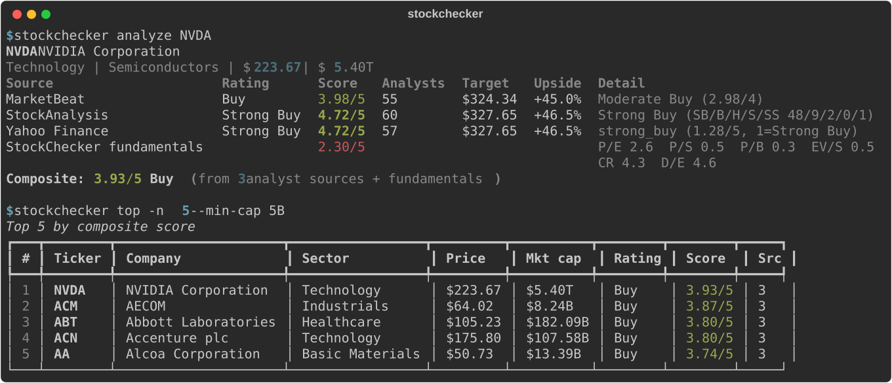
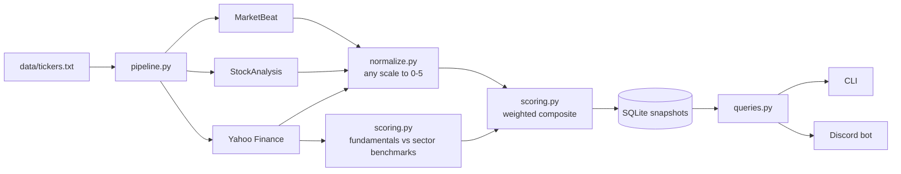
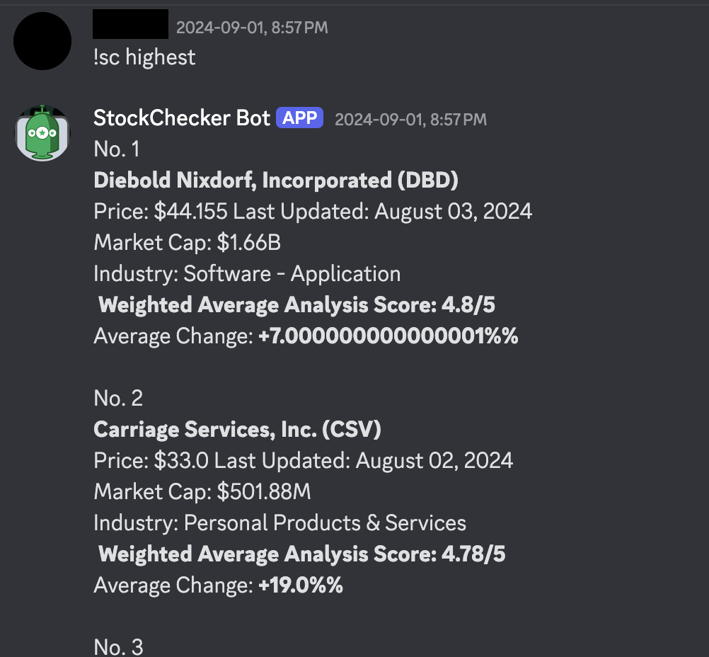

# StockChecker

One analyst rating is an opinion. StockChecker collects the consensus from several
independent sources, puts every one of them on the same 0–5 scale, adds its own
sector-aware valuation check, and gives you a single composite score you can rank a
whole universe of tickers by — from the terminal or from Discord.



```text
$ stockchecker analyze AAPL
AAPL  Apple Inc.
Technology | Consumer Electronics | $315.34 | $4.60T
Source                     Rating   Score  Analysts   Target  Upside  Detail
MarketBeat                 Buy     3.51/5        39  $331.53   +5.1%  Moderate Buy (2.51/4)
StockAnalysis              Buy     3.79/5        44  $324.53   +2.9%  Buy (SB/B/H/S/SS 19/6/13/3/3)
Yahoo Finance              Buy     3.77/5        38  $323.86   +2.7%  buy (2.23/5, 1=Strong Buy)
StockChecker fundamentals          1.77/5                             P/E 2.2  P/S 1.7  P/B 0.0 ...
Composite: 3.21/5 Hold  (from 3 analyst sources + fundamentals)
```

Wall Street says *Buy*; a P/B ratio of 43 says *you are paying a lot for it*. The
composite says *Hold*. That tension is the point.

## What it does

- **Aggregates** analyst consensus from pluggable sources — currently MarketBeat and
  StockAnalysis.com (HTML) and Yahoo Finance (via `yfinance`).
- **Normalizes** each source's vocabulary and scale ("Moderate Buy", 2.51/4,
  `recommendationMean` 2.23 where 1 is best, a 19/6/13/3/3 headcount) onto one
  canonical 0–5 scale so they can be compared and averaged.
- **Scores fundamentals** against sector benchmarks (a P/E of 30 is normal for software
  and alarming for a utility) so the composite is not just an echo of the analysts.
- **Stores** an append-only history of snapshots in SQLite, so "what changed since the
  last scan" is a query, not a spreadsheet formula.
- **Answers questions** — top-rated by sector and size, biggest movers, one stock in
  detail — from a CLI and from Discord slash commands that share the same code path.
- **Fails gracefully.** Delisted tickers, sites that change layout, bot walls and rate
  limits are all recorded per source and never abort a scan.

## Quickstart

Python 3.11+.

```bash
git clone https://github.com/MartinPatr/Stock-Analyst.git && cd Stock-Analyst
python -m venv .venv && source .venv/bin/activate
pip install -e '.[dev]'

stockchecker analyze AAPL NVDA JPM      # live, prints the breakdown, saves a snapshot
stockchecker scan --limit 50            # first 50 tickers of data/tickers.txt
stockchecker top --sector Technology --min-cap 10B
stockchecker show nvidia                # ticker or company-name search, with history
stockchecker export results.csv
```

Configuration is optional; copy `.env.example` to `.env` to change the database path,
request pacing, worker count or universe file.

### Commands

| Command | What it does |
| --- | --- |
| `analyze TICKER...` | Fetch live ratings and fundamentals, print the scored breakdown (`--json` for machines). |
| `scan [TICKER...]` | Analyze many tickers concurrently and store a snapshot of each. `--limit/--offset` page through the universe, `--resume` continues an interrupted run. |
| `top` | Highest composite scores. Filter with `--sector`, `--min-cap 500M`, `--min-coverage`. |
| `movers` | Largest composite changes since each ticker's previous snapshot (`--down` for drops). |
| `sectors` | Sectors present in the database, with counts. |
| `show QUERY` | Stored snapshot for one stock plus its score history. |
| `export PATH` | Latest snapshot of every ticker to `.csv` or `.json`. |
| `sources` | Registered rating sources and their weights. |

A full scan of the bundled 5,781-ticker universe takes about 1.5 hours at the default
one-request-per-second-per-host pacing; the sites we scrape are shared resources.

### Discord bot

1. Create an application at the [Discord developer portal](https://discord.com/developers/applications),
   add a bot, and invite it to your server with the `applications.commands` scope.
2. Put the token in `.env` as `DISCORD_TOKEN=...`.
3. `python -m stockchecker.bot`

| Slash command | |
| --- | --- |
| `/stock query [live]` | Detail card for a ticker or company name. `live:true` fetches fresh data. |
| `/top [count] [sector] [min_cap]` | Leaderboard from the latest scan. |
| `/movers [count] [sector] [min_cap] [down]` | Biggest score changes. |
| `/sectors` | Sectors in the database. |

The bot reads the same SQLite database the CLI writes, so run `stockchecker scan` on a
schedule (cron, a systemd timer) and the bot always answers from fresh data.

## How the score works



**Canonical scale.** 1 = Strong Sell, 2 = Sell, 3 = Hold, 4 = Buy, 5 = Strong Buy.

| Source | Native data | Mapping |
| --- | --- | --- |
| MarketBeat | Label + score on 1–4 (Sell=1 … Strong Buy=4) | score + 1, so their Hold (2) is our Hold (3) |
| StockAnalysis | Latest-month Strong Buy/Buy/Hold/Sell/Strong Sell headcount | Weighted mean of the buckets |
| Yahoo Finance | `recommendationMean` on 1–5 where 1 is Strong Buy | 6 − mean |

Labels are also understood in free text ("Moderate Buy", "Outperform", "Reduce",
"Equal-Weight"…) for sources that publish only words.

**Fundamentals score.** Six ratios from Yahoo — P/E, P/S, P/B, EV/Sales, current ratio,
debt/equity — are each compared with a benchmark for the company's sector. A ratio
sitting exactly on its benchmark scores 0.5; a "lower is better" ratio at twice the
benchmark scores 0.2, at half the benchmark 0.8 (the curve is \(1/(1+(v/b)^2)\); the
current ratio uses its mirror image). Negative P/E or D/E (losses, negative equity) score
0 rather than "cheap". Missing ratios are dropped and the weights renormalized; at least
two are required. The weighted mean is scaled to 0–5.

**Composite.** Weighted mean of every source's canonical score plus the fundamentals
score, each with weight 1 by default (`Source.weight` is per source). `coverage` counts
analyst sources only. Rankings require two sources by default so a single opinion on an
obscure ticker cannot top the board.

## Adding a source

Subclass `Source`, return a `Rating` on the canonical scale, and register the class:

```python
# stockchecker/sources/example.py
from stockchecker.models import Rating
from stockchecker.normalize import label_from_text, score_from_label
from stockchecker.sources.base import ParseError, Source
from stockchecker.sources.http import get_session

class ExampleSource(Source):
    name = "Example"
    weight = 1.0

    def fetch(self, ticker: str) -> Rating | None:
        html = get_session().get(f"https://example.com/{ticker}").text
        label_text = ...  # find it in the page; raise ParseError if it is gone
        label = label_from_text(label_text)
        return Rating(self.name, label, score_from_label(label), raw=label_text)
```

Then add it to `SOURCES` in `stockchecker/sources/__init__.py`. The shared session
handles headers, per-host pacing, retries and turns 403/404/bot walls into typed errors;
the pipeline records those errors per ticker and carries on. Save a page as a test
fixture under `tests/fixtures/` so the parser is covered offline.

## Development

```bash
pytest            # 100+ offline tests: parsers on saved HTML, scoring, storage, CLI, bot
pytest --live     # also hit the real sites (catches layout changes)
ruff check . && ruff format .
```

Layout:

```text
stockchecker/
  sources/        Source ABC, polite HTTP session, one module per source
  normalize.py    every source's scale -> canonical 0-5
  scoring.py      fundamentals score, sector benchmarks, composite
  pipeline.py     analyze one ticker / scan many (threaded, resumable)
  storage.py      SQLite snapshots with history
  queries.py      lookup / top / movers / sectors, shared by CLI and bot
  cli.py          Typer CLI
  bot/            discord.py slash commands + embed builders
tests/            pytest suite, HTML fixtures
data/tickers.txt  bundled universe (TICKER,Name,Exchange)
```

## History

The first version of this project (2024) scraped five sites with hard-coded CSS classes,
used a Google Sheet as its database, rotated through API keys to dodge rate limits and
read its own results back by scraping the sheet from a Discord bot. Three of the five
sites are now behind bot walls and one no longer exists. This rewrite keeps the idea —
many opinions, one normalized score, ask it from chat — and replaces everything else.
The original bot in action:



## Disclaimer

This is a research and learning tool. Scores summarize third-party opinions and simple
ratio heuristics; they are not investment advice.
