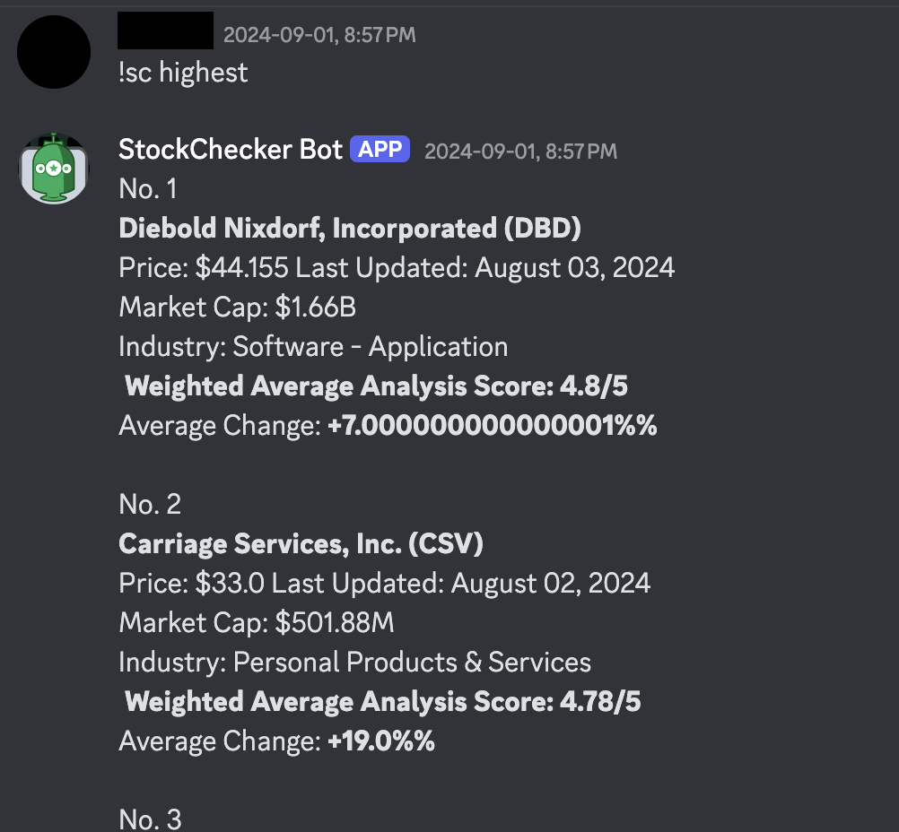

# Stock Analyzer

## Overview

**Stock Analyzer** is a full-stack tool built to collect, analyze, and surface professional stock recommendations. Originally created as a personal project to make investing less intimidating, it scrapes data from sites like MarketBeat and Barchart, stores it in a MongoDB database, and makes it accessible via a Google Sheet and a Discord bot called **StockChecker**.

### Features
- Aggregates analyst recommendations and price targets from multiple sources
- Normalizes scores using a 5-point weighted scale
- Stores and updates data in MongoDB
- Auto-populates a Google Sheet for visibility and reporting
- Discord bot interface for real-time queries and rankings

> ⚠️ **Note:** This project is no longer actively maintained due to expired AWS credits and early-stage design decisions. That said, writing this makes me want to fix it up and bring it back better than ever.

---

## Example Output

Below is a screenshot of the StockChecker Discord bot responding to a `!sc highest` query, showing top stock picks based on weighted analyst sentiment:



---

## File Descriptions

### `main.py`
Main driver script for gathering data and populating outputs.

**Responsibilities:**
- Reads stock tickers from `data/tickers.txt`
- Initializes scraping session
- Collects and processes recommendation data
- Populates Google Sheets and optionally writes to MongoDB

**Function:**
main(numberStart=0, numberEnd=6000) : Initializes the Google Sheets API using the provided credentials and returns the worksheet object.
- `populate_sheet(wks, stock)`: Populates the Google Sheet with the provided stock data. It checks if the stock ticker already exists in the sheet and updates or adds new data accordingly.
- `populate_db(stock)`: Stores the provided stock data in a MongoDB database.

### Supporting Files

#### data/tickers.txt
- A file containing a list of stock tickers to be analyzed.

#### creds/credentials.json
- A JSON file containing the credentials required to authenticate with the Google Sheets API.

#### creds/creds.json
- A JSON file containing the connection string for the MongoDB database.

## Usage

1. **Setup Google API Credentials:**
   - Ensure you have a `credentials.json` file with the necessary Google API credentials.
   - Place this file in the `creds` directory.

2. **Setup MongoDB Credentials:**
   - Ensure you have a `creds.json` file with the necessary MongoDB connection string.
   - Place this file in the `creds` directory.

3. **Run the Main Script:**
   ```bash
   python main.py
